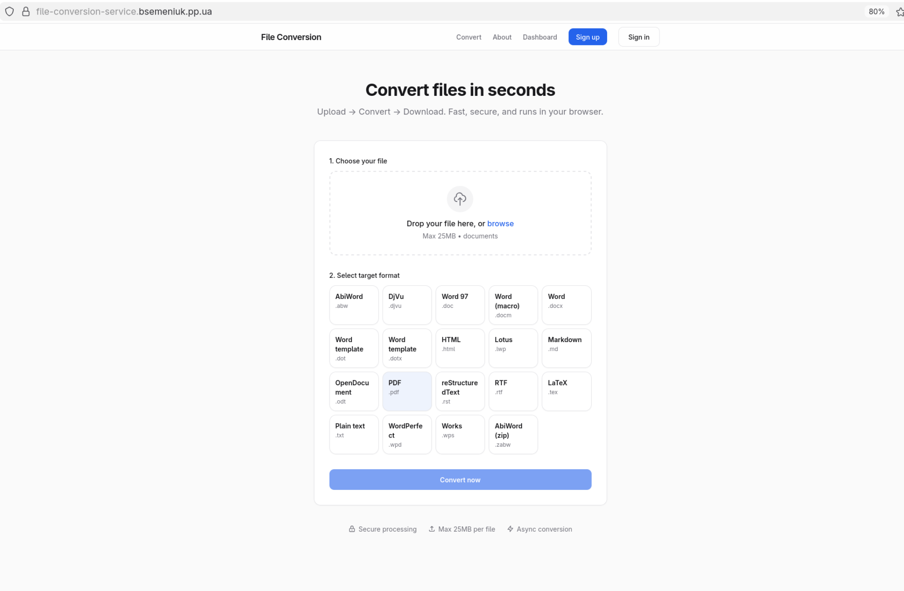
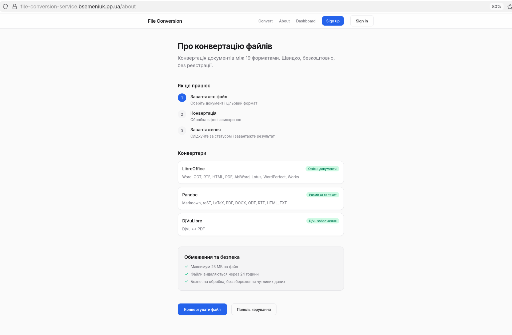
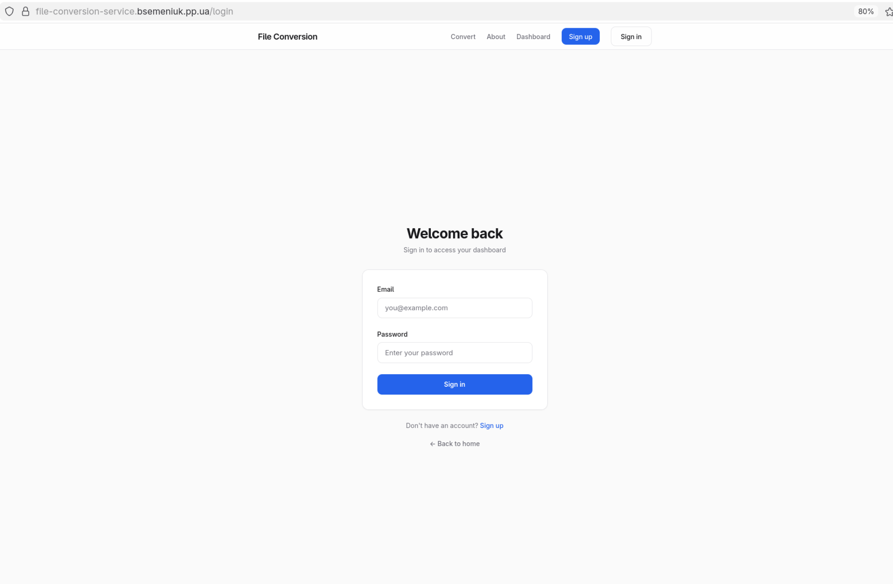
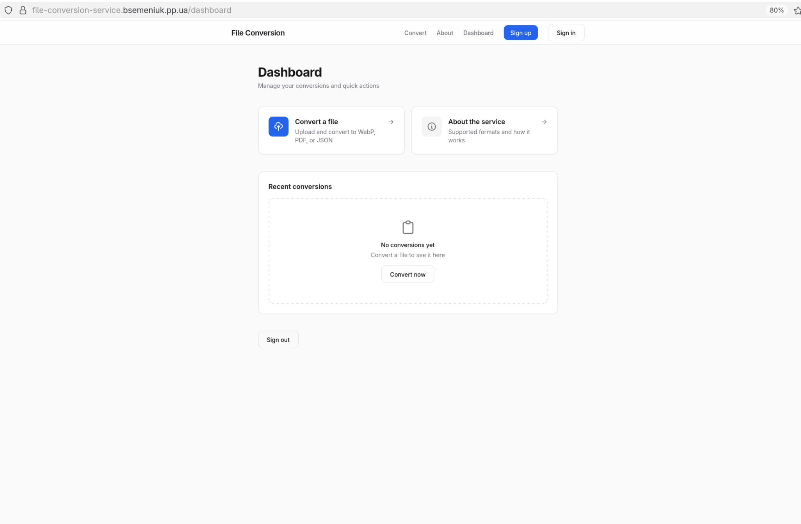

# File Conversion Service

Курсовий проект для конвертації файлів через веб-інтерфейс.
Користувач завантажує файл, вибирає формат, а обробка йде у фоновому режимі.

Deployed app URL: https://file-conversion-service.bsemeniuk.pp.ua/

## Що реалізовано

- реєстрація і вхід користувача;
- публічні та приватні сторінки;
- динамічний маршрут для перегляду конкретної задачі;
- конвертація файлів через чергу;
- перевірка статусу та завантаження результату.

## Технології

- Next.js (App Router) + TypeScript
- Prisma + MySQL
- Redis + BullMQ
- Docker Compose

## Запуск через Docker

```bash
docker compose up --build
```

Після запуску відкрити: `http://localhost:3000`

## Сторінки

- `/` - головна (публічна)
- `/about` - сторінка про проєкт (публічна)
- `/login` - вхід
- `/register` - реєстрація
- `/dashboard` - кабінет користувача (потрібна авторизація)
- `/jobs/[jobId]` - динамічна сторінка задачі

## Скріншоти

### Рисунок 1 - Головна сторінка


### Рисунок 2 - Сторінка "Про проєкт"


### Рисунок 3 - Сторінка входу


### Рисунок 4 - Сторінка реєстрації


### Рисунок 5 - Dashboard (сторінка після входу)


### Рисунок 6 - Завантаження файлу


### Рисунок 7 - Успішна конвертація


## Основні API-запити

У проєкті API використовується для створення задачі конвертації, перевірки її статусу та завантаження готового файлу.

- `POST /api/jobs` - створити нову задачу конвертації
- `GET /api/jobs/{jobId}?token=...` - отримати поточний статус задачі
- `GET /api/jobs/{jobId}/download?token=...` - завантажити результат після успішної обробки
- `DELETE /api/jobs/{jobId}?token=...` - видалити задачу та пов'язані файли

## Додаткова документація

- `docs/PROJECT.md`
- `docs/BACKEND.md`
- `docs/API.md`
